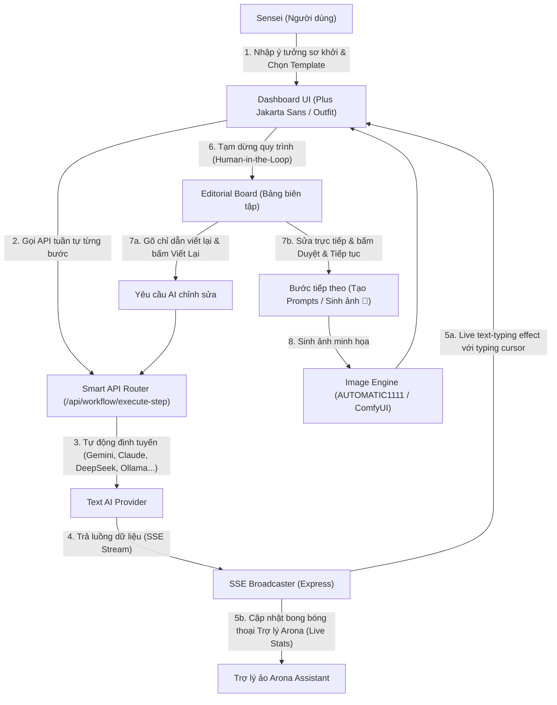

# 🎬 AI Cinematic OS (Blue Archive Arona v2.5 Theme)

Chào mừng bạn đến với **AI Cinematic OS** — Một Dashboard điều phối quy trình làm việc (Workflow Engine) AI chuyên nghiệp dành cho các tác vụ viết kịch bản điện ảnh, xây dựng kịch bản phân cảnh (Storyboard), và tạo hình ảnh minh họa chất lượng cao.

Dự án sở hữu giao diện kính mờ hiện đại lấy cảm hứng từ nhân vật **Arona trong Blue Archive**, tích hợp trợ lý ảo thời gian thực và bảng biên tập **Human-in-the-Loop (Con người kiểm soát)** tối ưu hóa cho công việc sáng tạo điện ảnh chuyên sâu.

---

## 🎨 Sơ đồ luồng hoạt động hệ thống

Quy trình hoạt động phối hợp giữa người dùng (Sensei), Trợ lý ảo Arona, hệ thống API và mô hình AI được biểu diễn qua sơ đồ dưới đây:



---

## ✨ Điểm nổi bật của phiên bản v2.5

### 1. Giao diện Kính mờ Siêu trực quan (Arona v2.5 Glassmorphic Design)
*   **Aesthetics đỉnh cao:** Giao diện hòa quyện giữa phong cách Cyber-Pastel của Shittim Chest (Blue Archive) với lớp phủ kính mờ nhẹ nhàng (`backdrop-filter: blur(14px)`).
*   **Trải nghiệm đọc tối ưu:** Sử dụng các font chữ cao cấp `Plus Jakarta Sans` và `Outfit` để tăng tính hiện đại. Toàn bộ chữ đậm được tăng 50% độ dày và giảm độ mờ đi 30% (`blur` từ 35px về 24px trên ảnh nền lớp học `357159.jpg`) để đảm bảo văn bản hiển thị sắc nét nhất trên mọi kích thước màn hình.
*   **Tránh đè lớp nội dung:** Đã khắc phục triệt để lỗi chữ bị mờ nhạt bằng cách di chuyển lớp giả gradient nền `.card::before` xuống dưới thông qua thuộc tính `z-index: -1`.

### 2. Trợ lý Arona ảo hoạt động thời gian thực (Live Arona Assistant)
*   **Tính cách sinh động:** Avatar Chibi của Arona được thiết kế chuyên nghiệp, đi kèm bong bóng thoại tương tác.
*   **Mô tả tiến trình theo thời gian thực:** Khi AI đang stream kết quả, Arona sẽ đếm số từ theo thời gian thực và trích xuất đoạn văn bản xem trước hiển thị trong bong bóng thoại của mình:
    > "Em đang ghi chép kịch bản cho bước Story Generation nè Sensei! Đã viết được 42 từ rồi đó... ✍️"

### 3. Quy trình cộng tác Con người - AI (Human-in-the-Loop Editorial Board)
*   Hệ thống không chạy tự động mù quáng từ đầu đến cuối mà cung cấp quyền kiểm soát tuyệt đối cho người dùng:
    *   **Pause & Inspect:** Tạm dừng ở cuối mỗi bước sinh kịch bản văn bản để người dùng đánh giá.
    *   **Direct Editing:** Cho phép người dùng chỉnh sửa trực tiếp nội dung văn bản thô hoặc cấu trúc JSON ngay tại chỗ.
    *   **Natural Language Rewrite:** Người dùng có thể gõ chỉ dẫn (ví dụ: *"Làm đoạn kết kịch tính và có hậu hơn"*) rồi bấm **Viết Lại**. Hệ thống sẽ tự động ghép nối chỉ dẫn này với kịch bản gốc và gọi AI cập nhật lại bước đó.
    *   **Approve & Feed-forward:** Khi ưng ý, người dùng bấm **Duyệt & Tiếp tục**, kết quả này lập tức được làm dữ liệu đầu vào ngữ cảnh (context) cho bước tiếp theo.

### 4. Tốc độ phản hồi cực nhanh (Local LLM Tags Caching)
*   Đã thiết lập bộ đệm in-memory cache (`CACHE_TTL = 30000ms`) cho việc liệt kê danh sách mô hình từ **Ollama** ở máy cục bộ. Tránh tình trạng dashboard bị giật/lag hoặc mất nhiều giây để tải danh sách thẻ tags mỗi khi người dùng truy cập hoặc gọi sinh văn bản.

---

## 📂 Kiến trúc thư mục và tài nguyên cốt lõi

Dự án được phát triển theo mô hình Client-Server gọn gàng và dễ mở rộng:

```text
ai-cinematic-os/
│
├── server/                     # BACK-END (Node.js & Express)
│   ├── index.js                # Điểm khởi chạy Server, cấu hình SSE Broadcaster & Middleware
│   ├── config.js               # Quản lý các biến môi trường, API keys và cấu hình model mặc định
│   ├── routes/                 # Các tuyến API endpoint
│   │   ├── workflow.js         # API điều phối đơn bước (/execute-step) và toàn bộ workflow
│   │   ├── ai.js               # Gọi sinh văn bản và chat đa nhà cung cấp
│   │   └── image.js            # Kết nối AUTOMATIC1111 và ComfyUI
│   └── services/               # Logic nghiệp vụ xử lý tích hợp
│       ├── workflow-engine.js  # Bộ máy phân tích, chạy kịch bản tuần tự và stream kết quả
│       ├── router.js           # Smart Router tự động chọn AI tối ưu cho từng loại tác vụ
│       └── ollama.js           # Kết nối mô hình LLM nội bộ (Ollama) có cache tags (30s)
│
├── public/                     # FRONT-END (SPA & Asset Tĩnh)
│   ├── index.html              # Shell duy nhất của ứng dụng SPA (sử dụng cache-buster v=2.5)
│   ├── css/                    # Hệ thống định kiểu UI Token
│   │   ├── variables.css       # Các biến token màu, font chữ tương phản, bóng mờ neon
│   │   ├── base.css            # Khởi tạo nền kính mờ tương phản cao (blur 24px từ 357159.jpg)
│   │   └── components.css      # Cấu hình card chống mờ chữ, nút phát sáng, thanh tiến trình
│   └── js/
│       ├── app.js              # Kích hoạt & định tuyến hiển thị các panel
│       ├── api.js              # Client HTTP thực hiện các cuộc gọi Axios/Fetch
│       ├── components/         # Các Widget cấu thành giao diện SPA
│       │   └── workflow-panel.js # Bảng điều khiển kịch bản 3 cột (Arona + Editorial Board)
│       └── utils/
│           └── sse.js          # Client lắng nghe SSE, tiếp nhận sự kiện 'workflow:step:progress'
│
├── img/                        # Chứa các tài nguyên hình ảnh nền tĩnh (357159.jpg)
├── data/                       # Lưu trữ file JSON cấu hình API keys cục bộ (keys.json)
└── output/                     # Thư mục lưu trữ hình ảnh được tạo ra từ Stable Diffusion
```

> [!NOTE]
> Bạn có thể trực tiếp tham khảo các tệp cấu hình giao diện quan trọng tại:
> *   Bộ định nghĩa token màu: [variables.css](public/css/variables.css)
> *   Thiết lập ảnh nền và độ tương phản: [base.css](public/css/base.css)
> *   Thiết kế card tránh đè lớp chữ: [components.css](public/css/components.css)
> *   Logic Front-end điều khiển Trợ lý Arona và biên tập: [workflow-panel.js](public/js/components/workflow-panel.js)

---

## 🛠️ Hướng dẫn cài đặt & Cấu hình nhanh

### 1. Chuẩn bị môi trường
*   Cài đặt **Node.js** phiên bản 18 trở lên.
*   (Tùy chọn) Cài đặt **Ollama** nếu muốn chạy mô hình ngôn ngữ lớn nội bộ (ví dụ: `qwen2.5`, `llama3`).
*   (Tùy chọn) Mở sẵn **AUTOMATIC1111** (chạy kèm cờ `--api`) hoặc **ComfyUI** nếu muốn tạo ảnh minh họa tự động.

### 2. Cài đặt các gói phụ thuộc
Tải dự án về máy, mở terminal tại thư mục gốc và chạy:
```bash
npm install
```

### 3. Cấu hình biến môi trường
Tạo một tệp tin mang tên `.env` ở thư mục gốc của dự án (tham khảo mẫu trong [.env.example](.env.example)):
```env
PORT=3000

# API Keys cho các dịch vụ đám mây (nếu có)
OPENAI_API_KEY=your_openai_key_here
GEMINI_API_KEY=your_gemini_key_here
CLAUDE_API_KEY=your_claude_key_here
DEEPSEEK_API_KEY=your_deepseek_key_here

# Địa chỉ kết nối LLM nội bộ (Ollama)
OLLAMA_URL=http://localhost:11434

# Địa chỉ kết nối Stable Diffusion tạo ảnh
A1111_URL=http://localhost:7860
COMFYUI_URL=http://localhost:8188
```

---

## 🚀 Khởi chạy dự án

Bắt đầu chạy server Node.js ở chế độ phát triển:
```bash
npm start
```
*Hoặc bạn cũng có thể chạy lệnh:*
```bash
npm run dev
```

Sau khi server khởi động thành công:
1.  Mở trình duyệt web và truy cập: `http://localhost:3000`
2.  Giao diện **AI Cinematic OS v2.5** mờ ảo tuyệt đẹp với hình nền lớp học Arona sẽ xuất hiện.
3.  Truy cập menu **Workflow** ở thanh bên (Sidebar), chọn một Template (như *Anime Script Generator*), nhập ý tưởng và theo dõi Trợ lý Arona thực hiện công việc từng bước.

---

## 📋 Chi tiết các API Endpoint chính

Dưới đây là bảng tổng hợp các endpoint API mà hệ thống cung cấp phục vụ cho việc điều khiển và lấy trạng thái:

### 1. Nhóm API điều phối quy trình (Workflow Engine)
| Phương thức | Đường dẫn API | Tham số đầu vào (JSON) | Mô tả tính năng |
| :--- | :--- | :--- | :--- |
| **POST** | `/api/workflow/execute` | `{ "templateId": "...", "input": "..." }` | Chạy tự động toàn bộ quy trình từ đầu đến cuối. |
| **POST** | `/api/workflow/execute-step` | `{ "templateId": "...", "stepIndex": 0, "input": "...", "prevResults": {} }` | **[Mới]** Chạy duy nhất một bước cụ thể, hỗ trợ Human-in-the-Loop. |
| **GET** | `/api/workflow/templates` | *Không có* | Trả về danh sách tất cả các quy trình mẫu sẵn có. |
| **GET** | `/api/workflow/status/:id` | *Không có* | Lấy trạng thái tiến trình thực thi của một ID workflow. |

### 2. Nhóm API điều khiển Trí tuệ Nhân tạo Văn bản (Text LLM)
| Phương thức | Đường dẫn API | Tính năng |
| :--- | :--- | :--- |
| **POST** | `/api/ai/generate` | Sinh văn bản một lần từ nhà cung cấp được cấu hình sẵn. |
| **POST** | `/api/ai/chat` | Chat hội thoại liên tục (hỗ trợ lưu ngữ cảnh lịch sử). |
| **GET** | `/api/ai/stream` | Stream ký tự phản hồi từ mô hình LLM theo thời gian thực. |

### 3. Nhóm API tạo hình ảnh (Image Generator)
| Phương thức | Đường dẫn API | Tính năng |
| :--- | :--- | :--- |
| **POST** | `/api/image/txt2img` | Chuyển văn bản thành hình ảnh qua A1111 hoặc ComfyUI. |
| **POST** | `/api/image/img2img` | Biến đổi hình ảnh cũ kèm prompt thành hình ảnh mới. |
| **GET** | `/api/image/models` | Liệt kê danh sách các checkpoints đang được tải trên Stable Diffusion. |
| **POST** | `/api/image/interrupt` | Dừng khẩn cấp công việc sinh hình ảnh đang chạy giữa chừng. |
| **GET** | `/api/image/history` | Xem lịch sử toàn bộ các tác phẩm ảnh đã tạo và lưu cục bộ. |

---

## 💡 Cơ chế tối ưu hóa cục bộ

Hệ thống được thiết kế đặc biệt hướng tới việc chạy các mô hình AI cục bộ gọn nhẹ nhằm bảo mật dữ liệu và tiết kiệm chi phí:

### Định tuyến thông minh có dự phòng (Smart Fallback Router)
Khi gửi yêu cầu văn bản hoặc hình ảnh, Smart Router tại [router.js](server/services/router.js) hoạt động theo nguyên lý ưu tiên:
1.  Tìm kiếm nhà cung cấp dịch vụ được ưu tiên hàng đầu theo loại tác vụ (ví dụ: `gemini` cho tác vụ viết kịch bản dài, hoặc `openai` cho viết prompts).
2.  Kiểm tra xem API Key của nhà cung cấp đó có khả dụng không.
3.  Nếu không khả dụng hoặc bị lỗi phản hồi quá hạn (timeout), router sẽ tự động chuyển sang nhà cung cấp kế tiếp trong chuỗi thứ tự (Fallback Chain).
4.  Nhà cung cấp cục bộ **Ollama** luôn nằm ở cuối danh sách dự phòng để đảm bảo hệ thống luôn hoạt động ngay cả khi ngắt kết nối Internet toàn cầu.

### Bộ đệm in-memory cho các thẻ tags Ollama
Mỗi khi khởi động hoặc truy cập trang, hệ thống cần biết danh sách mô hình offline đang được cài trong Ollama. Thay vì gọi API liên tục gây thắt nút cổ chai (bottleneck) đường truyền mạng nội bộ, tệp [ollama.js](server/services/ollama.js) áp dụng mô hình lưu trữ tạm thời:
```javascript
let cachedModels = null;
let lastModelsFetch = 0;
const CACHE_TTL = 30000; // Bộ đệm tồn tại trong 30 giây

async function getModels() {
  const now = Date.now();
  if (cachedModels && (now - lastModelsFetch < CACHE_TTL)) {
    return cachedModels; // Trả ngay dữ liệu trong bộ nhớ cache
  }
  // Nếu quá 30 giây, tiến hành gọi API thật để cập nhật mới...
}
```

---

## 💙 Ghi chú dành cho người phát triển

*   **Không sử dụng TailwindCSS:** Giao diện được xây dựng 100% bằng Vanilla CSS và HSL Color Tokens thiết lập trong [variables.css](public/css/variables.css). Khi muốn thay đổi bảng màu hoặc font chữ hệ thống, vui lòng chỉ khai báo hoặc chỉnh sửa các CSS variables tương ứng.
*   **Tránh đè lớp phủ (z-index):** Khi thiết kế thêm các thẻ card (`.card`) hoặc panel mới, luôn đảm bảo các thẻ con của card có vị trí tương đối và không bị lớp giả `.card::before` che mờ.
*   **Sử dụng cache-buster khi chỉnh sửa frontend:** Toàn bộ liên kết script JS/CSS tĩnh trong [index.html](public/index.html) đều đi kèm tham số phiên bản `?v=2.5`. Sau khi sửa đổi front-end, hãy cập nhật số phiên bản này để tránh lỗi lưu đệm (browser caching) trên trình duyệt người dùng.

Dự án này là minh chứng hoàn hảo cho sự kết hợp giữa **Thiết kế giao diện giàu cảm xúc (Rich Emotional Design)** và **Quy trình hoạt động thông minh do con người kiểm soát (Human-in-the-Loop AI Orchestration)**. Hãy bắt đầu xây dựng bộ phim tiếp theo của bạn ngay hôm nay cùng Trợ lý Arona! 🎬💙
